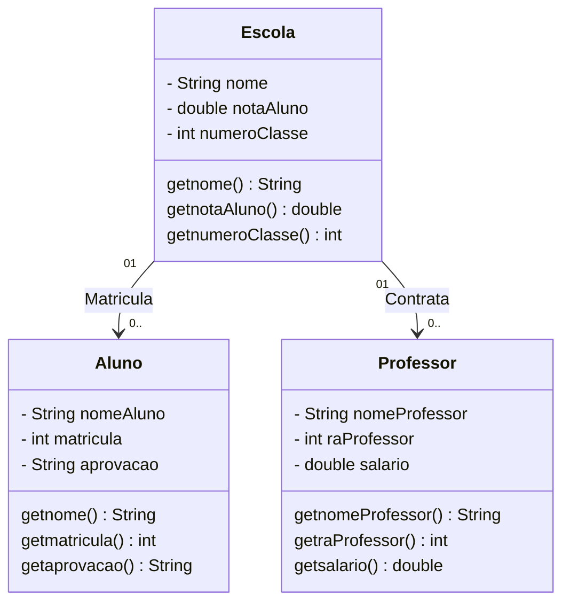

### Engenharia de Software
## Atividades 1 a 8
 
<h1> #1. Comentar com suas palavras o primeiro trecho do livro Software Engineering at Google, Oreilly: </h1>

O texto fala sobre as diferenças entre a engenharia de Software, Programação e Ciência da Computação, explicando principalmente que engenharia de software não se trata só de programar, já que esse segundo termo se refere mais especificamente a escrever código, enquanto o primeiro envolve aplicar conhecimento teórico e boas práticas para construir sistemas mais duradouros e confiáveis. Ele também faz uma comparação entre engenheiros de software com engenheiros de áreas tradicionais, que seguem regras e padrões rigorosos, e destaca que a área tecnológica possui mais falhas quanto à seguimento de processos e prosseguimento de métodos padrões. O texto também enfatiza que os softwares têm se tornado essenciais na sociedade, sendo cada vez mais importante adotar métodos mais rigorosos e profissionais, semelhantes aos de outras engenharias, explicando também que a produção dos demais engenheiros é mais "tangível", enquanto o trabalho do engenheiro de Software é inacessível de maneira física. O texto sugere no fim que o objetivo do livro é mostrar possibilidades para tornar o desenvolvimento de software mais confiável e estruturado, contribuindo para a evolução da profissão.

<h1> #2. Comentar com suas palavras o segundo trecho do livro Software Engineering at Google, Oreilly: </h1>

O texto fala novamente que a engenharia de software não é só sobre escrever códigos, acrescentando o fato de que envolve todas as ferramentas, processos e práticas que podem ajudar uma empresa a criar e manter esse código ao longo do tempo. O foco é garantir que o software continue útil, sustentável e de qualidade, mesmo com as mudanças, quaisquer que sejam. Além disso, é destacado que a engenharia de software pode ser vista como “programação ao longo do tempo”. 
O texto também apresenta três princípios fundamentais que toda equipe de software deve considerar, que são tempo e mudança, escala e crescimento e custos e compensações.

1. Tempo e mudança
-O primeiro princípio parte da ideia de que todo software está em constante evolução.
Um programa não é algo estático, ele precisa mudar ao longo do tempo. Em engenharia de software, reconhecer a inevitabilidade da mudança é essencial. Por isso, o código deve ser escrito de forma que possa ser modificado com segurança e eficiência no futuro.

2. Escala e crescimento
-Em seguida, entende-se que esse princípio trata da complexidade crescente do software e das equipes. Conforme o sistema cresce, tanto em número de usuários quanto em quantidade de código, surgem novos desafios, como desempenho, coordenação entre equipes, manutenção e segurança. Destaca-se então que as soluções que funcionam em pequena escala podem se tornar insustentáveis em larga escala.

3. Custos e compensações
-Nesse princípio, é entendido que melhorar a performance pode aumentar o custo, enquanto simplificar o código pode reduzir a flexibilidade e lançar de maneira mais rápida pode comprometer a qualidade.

Por fim, é mostrado que a engenharia de software é sobre pensar no futuro, buscando práticas que tornem o código durável, escalável e sustentável.

<h1> #3. Listar e explicar 3 exemplos de tradeoffs: </h1>

Exemplo 1: Armazenamento local e Processamento em nuvem

É possível armazenar dados no dispositivo utilizado e será mais rápido e privado, porém exige mais recursos no processamento desses dados. Também é possível usar a nuvem para deixar o processamento mais leve, dependendo assim da internet.

Exemplo 2: Generalização e Simplicidade

É possível criar sistemas muito genéricos, mas pode haver maiores complicações no desenvolvimento do código de maneira desnecessaria, exigindo um grau de dificuldade maior do que o sistema que é feito para ser simples e resolver um problema pontual.

Exemplo 3: Custo e Escalabilidade

É possível criar um sistema capaz de suportar milhões de usuários, porém o nível exigido de infraestrutura e arquitetura serão amplamente mais custosos do que um sistema mais simples que suporta um número menos de pessoas

<h1> #4. Fazer 2 ou 3 exemplos de classes UML: </h1>




<h1> #5. Fazer esses exemplos de UML em JAVA: </h1>

```markdown

package org.example;

import java.util.ArrayList;
import java.util.List;

class Escola {
    private String nome;
    private double notaAluno;
    private int numeroClasse;

    // Listas de alunos e professores
    private List<Aluno> alunos;
    private List<Professor> professores;

    // Construtor
    public Escola(String nome, double notaAluno, int numeroClasse) {
        this.nome = nome;
        this.notaAluno = notaAluno;
        this.numeroClasse = numeroClasse;
        this.alunos = new ArrayList<>();
        this.professores = new ArrayList<>();
    }

    // Métodos getters
    public String getNome() {
        return nome;
    }

    public double getNotaAluno() {
        return notaAluno;
    }

    public int getNumeroClasse() {
        return numeroClasse;
    }

    // Métodos para gerenciar relacionamentos
    public void adicionarAluno(Aluno aluno) {
        alunos.add(aluno);
    }

    public void contratarProfessor(Professor professor) {
        professores.add(professor);
    }

    public void listarAlunos() {
        System.out.println("Alunos da escola " + nome + ":");
        for (Aluno a : alunos) {
            System.out.println("- " + a.getNomeAluno());
        }
    }

    public void listarProfessores() {
        System.out.println("Professores da escola " + nome + ":");
        for (Professor p : professores) {
            System.out.println("- " + p.getNomeProfessor());
        }
    }
}

class Aluno {
    private String nomeAluno;
    private int matricula;
    private String aprovacao;

    // Construtor
    public Aluno(String nomeAluno, int matricula, String aprovacao) {
        this.nomeAluno = nomeAluno;
        this.matricula = matricula;
        this.aprovacao = aprovacao;
    }

    // Métodos getters
    public String getNomeAluno() {
        return nomeAluno;
    }

    public int getMatricula() {
        return matricula;
    }

    public String getAprovacao() {
        return aprovacao;
    }
}

class Professor {
    private String nomeProfessor;
    private int raProfessor;
    private double salario;

    // Construtor
    public Professor(String nomeProfessor, int raProfessor, double salario) {
        this.nomeProfessor = nomeProfessor;
        this.raProfessor = raProfessor;
        this.salario = salario;
    }

    // Métodos getters
    public String getNomeProfessor() {
        return nomeProfessor;
    }

    public int getRaProfessor() {
        return raProfessor;
    }

    public double getSalario() {
        return salario;
    }
}

public class SistemaEscolar {
    public static void main(String[] args) {
        // Criando escola
        Escola escola = new Escola("Escola Modelo", 8.5, 101);

        // Criando alunos
        Aluno a1 = new Aluno("Guilherme", 123, "Aprovado");
        Aluno a2 = new Aluno("Ana", 124, "Reprovada");

        // Criando professores
        Professor p1 = new Professor("Marcos", 2001, 3500.0);
        Professor p2 = new Professor("Luciana", 2002, 4200.0);

        // Adicionando alunos e professores à escola
        escola.adicionarAluno(a1);
        escola.adicionarAluno(a2);
        escola.contratarProfessor(p1);
        escola.contratarProfessor(p2);

        // Exibindo resultados
        escola.listarAlunos();
        escola.listarProfessores();
    }
}
```
<h1> #6. Fazer testes customizados: </h1>

```markdown

import java.util.ArrayList;
import java.util.List;

class Escola {
    private String nome;
    private double notaAluno;
    private int numeroClasse;
    private List<Aluno> alunos;
    private List<Professor> professores;

    public Escola(String nome, double notaAluno, int numeroClasse) {
        this.nome = nome;
        this.notaAluno = notaAluno;
        this.numeroClasse = numeroClasse;
        this.alunos = new ArrayList<>();
        this.professores = new ArrayList<>();
    }

    public String getNome() {
        return nome;
    }

    public void adicionarAluno(Aluno aluno) {
        alunos.add(aluno);
    }

    public void contratarProfessor(Professor professor) {
        professores.add(professor);
    }

    public void listarAlunos() {
        System.out.println("\n=== Alunos da escola " + nome + " ===");
        for (Aluno a : alunos) {
            System.out.println("- " + a.getNomeAluno() + " | Matrícula: " + a.getMatricula() + " | " + a.getAprovacao());
        }
    }

    public void listarProfessores() {
        System.out.println("\n=== Professores da escola " + nome + " ===");
        for (Professor p : professores) {
            System.out.println("- " + p.getNomeProfessor() + " | RA: " + p.getRaProfessor() + " | Salário: R$ " + p.getSalario());
        }
    }

    public void listarAprovados() {
        System.out.println("\n--- Alunos Aprovados ---");
        for (Aluno a : alunos) {
            if (a.getAprovacao().equalsIgnoreCase("Aprovado")) {
                System.out.println(a.getNomeAluno());
            }
        }
    }
}

class Aluno {
    private String nomeAluno;
    private int matricula;
    private String aprovacao;

    public Aluno(String nomeAluno, int matricula, String aprovacao) {
        this.nomeAluno = nomeAluno;
        this.matricula = matricula;
        this.aprovacao = aprovacao;
    }

    public String getNomeAluno() {
        return nomeAluno;
    }

    public int getMatricula() {
        return matricula;
    }

    public String getAprovacao() {
        return aprovacao;
    }
}

class Professor {
    private String nomeProfessor;
    private int raProfessor;
    private double salario;

    public Professor(String nomeProfessor, int raProfessor, double salario) {
        this.nomeProfessor = nomeProfessor;
        this.raProfessor = raProfessor;
        this.salario = salario;
    }

    public String getNomeProfessor() {
        return nomeProfessor;
    }

    public int getRaProfessor() {
        return raProfessor;
    }

    public double getSalario() {
        return salario;
    }
}

public class SistemaEscolar {
    public static void main(String[] args) {
        Escola escola = new Escola("Escola Modelo", 8.5, 101);

        // Criando e adicionando alunos
        escola.adicionarAluno(new Aluno("Guilherme", 123, "Aprovado"));
        escola.adicionarAluno(new Aluno("Ana", 124, "Reprovada"));
        escola.adicionarAluno(new Aluno("João", 125, "Aprovado"));
        escola.adicionarAluno(new Aluno("Larissa", 126, "Aprovado"));

        // Criando e adicionando professores
        escola.contratarProfessor(new Professor("Marcos", 2001, 3500.0));
        escola.contratarProfessor(new Professor("Luciana", 2002, 4200.0));
        escola.contratarProfessor(new Professor("Paulo", 2003, 3900.0));

        // Teste 1: Listar todos os alunos e professores
        escola.listarAlunos();
        escola.listarProfessores();

        // Teste 2: Listar apenas alunos aprovados
        escola.listarAprovados();

        // Teste 3: Mostrar total de alunos e professores
        System.out.println("\nTotal de alunos: " + escola.getNome() + " possui " + 4 + " alunos.");
        System.out.println("Total de professores: " + 3);
    }
}

```
<h1> #7. Transformar o exemplo de JAVA em SQLite: </h1>

CREATE TABLE Escola (
    id_escola INTEGER PRIMARY KEY AUTOINCREMENT,
    nome TEXT NOT NULL,
    notaAluno REAL,
    numeroClasse INTEGER
);

-- Criação da tabela Aluno
CREATE TABLE Aluno (
    id_aluno INTEGER PRIMARY KEY AUTOINCREMENT,
    nomeAluno TEXT NOT NULL,
    matricula INTEGER UNIQUE,
    aprovacao TEXT,
    id_escola INTEGER,
    FOREIGN KEY (id_escola) REFERENCES Escola(id_escola)
);

-- Criação da tabela Professor
CREATE TABLE Professor (
    id_professor INTEGER PRIMARY KEY AUTOINCREMENT,
    nomeProfessor TEXT NOT NULL,
    raProfessor INTEGER UNIQUE,
    salario REAL,
    id_escola INTEGER,
    FOREIGN KEY (id_escola) REFERENCES Escola(id_escola)
);

-- Inserindo uma escola
INSERT INTO Escola (nome, notaAluno, numeroClasse)
VALUES ('Escola Modelo', 8.5, 101);

-- Inserindo alunos
INSERT INTO Aluno (nomeAluno, matricula, aprovacao, id_escola)
VALUES
('Guilherme', 123, 'Aprovado', 1),
('Ana', 124, 'Reprovada', 1),
('João', 125, 'Aprovado', 1),
('Larissa', 126, 'Aprovado', 1);

-- Inserindo professores
INSERT INTO Professor (nomeProfessor, raProfessor, salario, id_escola)
VALUES
('Marcos', 2001, 3500.00, 1),
('Luciana', 2002, 4200.00, 1),
('Paulo', 2003, 3900.00, 1);

-- Consultas de teste
SELECT * FROM Escola;
SELECT * FROM Aluno;
SELECT * FROM Professor;

-- Exemplo de junção (para listar alunos com o nome da escola)
SELECT a.nomeAluno, a.aprovacao, e.nome AS escola
FROM Aluno a
JOIN Escola e ON a.id_escola = e.id_escola;

-- Exemplo de junção (para listar professores com o nome da escola)
SELECT p.nomeProfessor, p.salario, e.nome AS escola
FROM Professor p
JOIN Escola e ON p.id_escola = e.id_escola;


<h1> #8. Usar ollama4j </h1>

```markdown

import java.io.IOException;
import java.net.URI;
import java.net.http.HttpClient;
import java.net.http.HttpRequest;
import java.net.http.HttpResponse;
import java.time.Duration;

public class OllamaClient {

    private static final String OLLAMA_URL = "http://localhost:11434/api/generate";

    private final HttpClient http;

    public OllamaClient() {
        this.http = HttpClient.newBuilder()
                .connectTimeout(Duration.ofSeconds(5))
                .build();
    }

    public String enviarPrompt(String model, String prompt) throws IOException, InterruptedException {
        String json = "{"
                + "\"model\": \"" + escapeJson(model) + "\","
                + "\"prompt\": \"" + escapeJson(prompt) + "\""
                + "}";

        HttpRequest request = HttpRequest.newBuilder()
                .uri(URI.create(OLLAMA_URL))
                .header("Content-Type", "application/json")
                .timeout(Duration.ofSeconds(60))
                .POST(HttpRequest.BodyPublishers.ofString(json))
                .build();

        HttpResponse<String> response = http.send(request, HttpResponse.BodyHandlers.ofString());

        int status = response.statusCode();
        if (status >= 200 && status < 300) {
            return response.body();
        } else {
            throw new IOException("Erro HTTP " + status + ": " + response.body());
        }
    }

    private static String escapeJson(String s) {
        return s.replace("\\", "\\\\").replace("\"", "\\\"");
    }

    public static void main(String[] args) {
        OllamaClient client = new OllamaClient();
        String model = "ollama-model-name"; // ex: "llama2", "ggml-..." — substitua
        String prompt = "Diga algo sobre as universidades brasileiras";

        try {
            String resposta = client.enviarPrompt(model, prompt);
            System.out.println("Resposta do Ollama:");
            System.out.println(resposta);
        } catch (Exception e) {
            System.err.println("Falha ao chamar Ollama: " + e.getMessage());
            e.printStackTrace();
        }
    }
}
```
