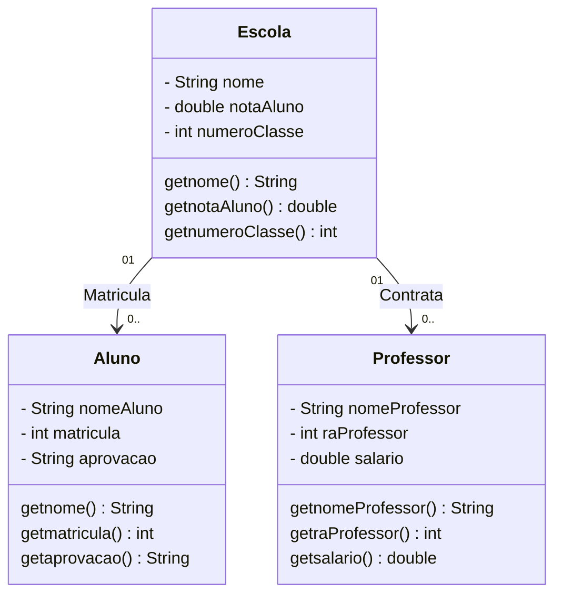

### Engenharia de Software
## Atividades 1 a 8

#1. Comentar com suas palavras o primeiro trecho do livro Software Engineering at Google, Oreilly:

O texto fala sobre as diferenças entre a engenharia de Software, Programação e Ciência da Computação, explicando principalmente que engenharia de software não se trata só de programar, já que esse segundo termo se refere mais especificamente a escrever código, enquanto o primeiro envolve aplicar conhecimento teórico e boas práticas para construir sistemas mais duradouros e confiáveis. Ele também faz uma comparação entre engenheiros de software com engenheiros de áreas tradicionais, que seguem regras e padrões rigorosos, e destaca que a área tecnológica possui mais falhas quanto à seguimento de processos e prosseguimento de métodos padrões. O texto também enfatiza que os softwares têm se tornado essenciais na sociedade, sendo cada vez mais importante adotar métodos mais rigorosos e profissionais, semelhantes aos de outras engenharias, explicando também que a produção dos demais engenheiros é mais "tangível", enquanto o trabalho do engenheiro de Software é inacessível de maneira física. O texto sugere no fim que o objetivo do livro é mostrar possibilidades para tornar o desenvolvimento de software mais confiável e estruturado, contribuindo para a evolução da profissão.

#2. Comentar com suas palavras o segundo trecho do livro Software Engineering at Google, Oreilly:

O texto fala novamente que a engenharia de software não é só sobre escrever códigos, acrescentando o fato de que envolve todas as ferramentas, processos e práticas que podem ajudar uma empresa a criar e manter esse código ao longo do tempo. O foco é garantir que o software continue útil, sustentável e de qualidade, mesmo com as mudanças, quaisquer que sejam. Além disso, é destacado que a engenharia de software pode ser vista como “programação ao longo do tempo”. O texto também apresenta três princípios fundamentais que toda equipe de software deve considerar, que são tempo e mudança, escala e crescimento e custos e compensações. Por fim, é mostrado que a engenharia de software é sobre pensar no futuro, buscando práticas que tornem o código durável, escalável e sustentável.

#3. Listar e explicar 3 exemplos de tradeoffs:

Exemplo 1: Armazenamento local e Processamento em nuvem
É possível armazenar dados no dispositivo utilizado e será mais rápido e privado, porém exige mais recursos no processamento desses dados. Também é possível usar a nuvem para deixar o processamento mais leve, dependendo assim da internet.

Exemplo 2: Generalização e Simplicidade
É possível criar sistemas muito genéricos, mas pode haver maiores complicações no desenvolvimento do código de maneira desnecessaria, exigindo um grau de dificuldade maior do que o sistema que é feito para ser simples e resolver um problema pontual.

Exemplo 3: Custo e Escalabilidade
É possível criar um sistema capaz de suportar milhões de usuários, porém o nível exigido de infraestrutura e arquitetura serão amplamente mais custosos do que um sistema mais simples que suporta um número menos de pessoas

#4. Fazer 2 ou 3 exemplos de classes UML:



#5. Fazer esses exemplos de UML em JAVA:
```mermaid
package org.example;

import java.util.ArrayList;
import java.util.List;

class Escola {
    private String nome;
    private double notaAluno;
    private int numeroClasse;

    // Listas de alunos e professores
    private List<Aluno> alunos;
    private List<Professor> professores;

    // Construtor
    public Escola(String nome, double notaAluno, int numeroClasse) {
        this.nome = nome;
        this.notaAluno = notaAluno;
        this.numeroClasse = numeroClasse;
        this.alunos = new ArrayList<>();
        this.professores = new ArrayList<>();
    }

    // Métodos getters
    public String getNome() {
        return nome;
    }

    public double getNotaAluno() {
        return notaAluno;
    }

    public int getNumeroClasse() {
        return numeroClasse;
    }

    // Métodos para gerenciar relacionamentos
    public void adicionarAluno(Aluno aluno) {
        alunos.add(aluno);
    }

    public void contratarProfessor(Professor professor) {
        professores.add(professor);
    }

    public void listarAlunos() {
        System.out.println("Alunos da escola " + nome + ":");
        for (Aluno a : alunos) {
            System.out.println("- " + a.getNomeAluno());
        }
    }

    public void listarProfessores() {
        System.out.println("Professores da escola " + nome + ":");
        for (Professor p : professores) {
            System.out.println("- " + p.getNomeProfessor());
        }
    }
}

class Aluno {
    private String nomeAluno;
    private int matricula;
    private String aprovacao;

    // Construtor
    public Aluno(String nomeAluno, int matricula, String aprovacao) {
        this.nomeAluno = nomeAluno;
        this.matricula = matricula;
        this.aprovacao = aprovacao;
    }

    // Métodos getters
    public String getNomeAluno() {
        return nomeAluno;
    }

    public int getMatricula() {
        return matricula;
    }

    public String getAprovacao() {
        return aprovacao;
    }
}

class Professor {
    private String nomeProfessor;
    private int raProfessor;
    private double salario;

    // Construtor
    public Professor(String nomeProfessor, int raProfessor, double salario) {
        this.nomeProfessor = nomeProfessor;
        this.raProfessor = raProfessor;
        this.salario = salario;
    }

    // Métodos getters
    public String getNomeProfessor() {
        return nomeProfessor;
    }

    public int getRaProfessor() {
        return raProfessor;
    }

    public double getSalario() {
        return salario;
    }
}

public class SistemaEscolar {
    public static void main(String[] args) {
        // Criando escola
        Escola escola = new Escola("Escola Modelo", 8.5, 101);

        // Criando alunos
        Aluno a1 = new Aluno("Guilherme", 123, "Aprovado");
        Aluno a2 = new Aluno("Ana", 124, "Reprovada");

        // Criando professores
        Professor p1 = new Professor("Marcos", 2001, 3500.0);
        Professor p2 = new Professor("Luciana", 2002, 4200.0);

        // Adicionando alunos e professores à escola
        escola.adicionarAluno(a1);
        escola.adicionarAluno(a2);
        escola.contratarProfessor(p1);
        escola.contratarProfessor(p2);

        // Exibindo resultados
        escola.listarAlunos();
        escola.listarProfessores();
    }
}


#6. Fazer testes customizados:

Teste para alunos:

classDiagram
class TesteAluno {
    // public static void main(String[] args) 
    // Criando objetos Aluno com dados fixos
        Aluno aluno1 = new Aluno("Maria Silva", 101, 8.5, 7.0);
        Aluno aluno2 = new Aluno("João Pereira", 102, 5.0, 4.5);
        Aluno aluno3 = new Aluno("Ana Costa", 103, 9.0, 9.5);

   // Para exibir os resultados
        System.out.println("=== TESTES DE ALUNO ===");
        aluno1.exibirInfo();
        aluno2.exibirInfo();
        aluno3.exibirInfo();
}


Teste para produtos:

classDiagram
class TesteProduto {
    public static void main(String[] args) 
        // Criando produtos
        Produto p1 = new Produto(1, "Notebook", 3500.00, 10);
        Produto p2 = new Produto(2, "Mouse", 150.00, 50);

System.out.println("=== TESTES DE PRODUTO ===");
        p1.exibirInfo();
        p2.exibirInfo();

//Teste de atualização de estoque
        System.out.println("\nAdicionando 5 unidades ao estoque do Notebook...");
        p1.atualizarEstoque(5);
        p1.exibirInfo();

//Teste de desconto
        System.out.println("\nAplicando 10% de desconto no Mouse Gamer...");
        double novoPreco = p2.calcularDesconto(10);
        System.out.println("Preço com desconto: R$ " + novoPreco);

//Teste combinado
        System.out.println("\nResumo Final:");
        p1.exibirInfo();
        p2.exibirInfo();
}

#7. Transformar o exemplo de JAVA em SQLite:

-- ===============================
-- Tabela: Usuario
-- ===============================
CREATE TABLE Usuario (
    id INTEGER PRIMARY KEY AUTOINCREMENT,
    nome TEXT NOT NULL,
    email TEXT NOT NULL UNIQUE,
    senha TEXT NOT NULL
);

-- ===============================
-- Tabela: Livro
-- ===============================
CREATE TABLE Livro (
    id INTEGER PRIMARY KEY AUTOINCREMENT,
    titulo TEXT NOT NULL,
    autor TEXT NOT NULL,
    ano_publicacao INTEGER,
    disponivel BOOLEAN DEFAULT 1
);

-- ===============================
-- Tabela: Biblioteca
-- ===============================
CREATE TABLE Biblioteca (
    id INTEGER PRIMARY KEY AUTOINCREMENT,
    nome TEXT NOT NULL,
    endereco TEXT,
    telefone TEXT
);

-- ===============================
-- Tabela: Emprestimo (tabela relacional sugerida)
-- ===============================
-- Observação: caso o código da Biblioteca relacione Livros e Usuários
-- (o que é comum), aqui está uma tabela de ligação para gerenciar empréstimos.

CREATE TABLE Emprestimo (
    id INTEGER PRIMARY KEY AUTOINCREMENT,
    idUsuario INTEGER NOT NULL,
    idLivro INTEGER NOT NULL,
    dataEmprestimo DATE NOT NULL,
    dataDevolucao DATE,
    devolvido BOOLEAN DEFAULT 0,
    FOREIGN KEY (idUsuario) REFERENCES Usuario(id),
    FOREIGN KEY (idLivro) REFERENCES Livro(id)
);


#8. Usar ollama4j
